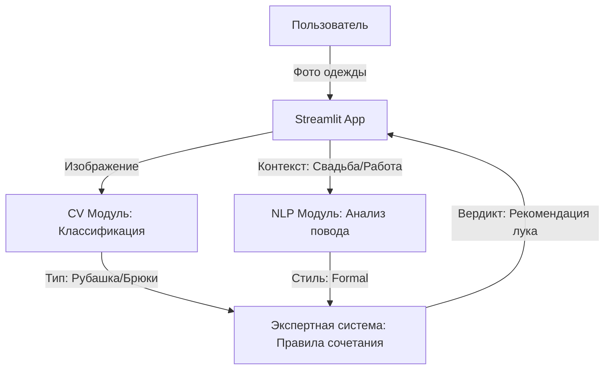

Smart Wardrobe AI

Дисциплина: Проектирование и разработка интеллектуальных систем

Описание проекта
Интеллектуальный помощник для управления гардеробом. Система предназначена для классификации предметов одежды по фотографиям и формирования рекомендаций по стилю на основе экспертных правил и заданного контекста (дресс-кода).

Стек технологий

Язык: Python 3.11+

Библиотеки: Pandas, OpenCV, Transformers (HuggingFace)

Интерфейс: Streamlit

Архитектура: Гибридная (Rule-based logic + ML)

Архитектурная схема
Фрагмент кода



Структура проекта

src/ — исходный код приложения.

data/ — локальное хранилище данных (игнорируется Git).

docs/ — документация и схемы.

requirements.txt — список зависимостей.

Установка и запуск

Создание окружения: python -m venv venv

Активация: .\venv\Scripts\activate (Windows)

Установка зависимостей: pip install -r requirements.txt

Запуск: streamlit run src/main.py

```

```
